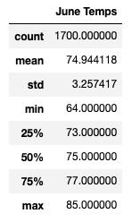
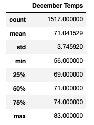
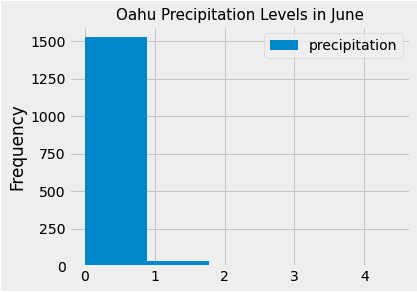
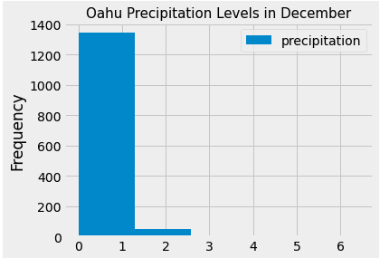

# Weather Analysis for Oahu's future Surf-and-Shake Shop

## Overview of the Analysis

### Purpose
The purpose of this analysis is to provide our interested investor, W. Avy, with a report describing the key differences in weather between June and December in Oahu, Hawaii, as part of our business proposal for a surf-and-shake shop. We used SQLAlchemy to query our SQLite database of weather data for vital information about temperatures and precipitation from 2010 to 2017 to support our choice of location and convince W. Avy of our plan's feasibility and success. 

The following report will summarize specific queries from our SQLite database that will address the three key differences in weather between June and December, along with two additional queries. 

## Results

### Summary statistics for June and December
Please see below for the summary statistic figures for June and December:

Figure A. Summary statistics for June temperatures 

Figure B. Summary statistics for December temperatures

### Differences in weather (temperature) between June and December
* The **mean temperature** for June is greater than the mean temperature for December by ~4 degrees Fahrenheit. This increase in temperature makes sense as Oahu, Hawaii, is located in the Northern Hemisphere. June is considered a "summer month" and will expect higher temperatures than December. It is important to note that the difference is insignificant, which means that the weather is stable in these months over the seven years of data collected. 

* The **minimum temperature** for June is ~8 degrees Fahrenheit greater than that of December, and the **maximum temperature** for June is only ~2 degrees Fahrenheit greater than that of December. Again, these minimal differences in temperature data suggest that the temperature is stable over the latter half of the year. It is important to note that June and December are potentially significant months for travel, so it's great that the weather remains stable at high but comfortable summer temperatures expected of vacation spots like Oahu, Hawaii. 

* The **IQR** for June is 4 degrees Fahrenheit, and the IQR for December is 5 degrees Fahrenheit. These statistics suggest a minimal, almost insignificant, difference in the range of temperatures between both months. 

## Summary

### Summarizing the results
In summary, the minimal differences in the recorded temperatures between June and December suggest that the weather is consistent at high but comfortable temperatures suitable for travellers, potentially leading towards the surf-and-shake shop's success. 

### Additional queries
To gather more weather data for further analysis, I performed two additional queries to understand the precipitation patterns for June and December and compare them.

Please see below histograms of precipitation levels for June and December resulting from the two queries:

Figure A. Histogram of precipitation levels for June

Figure B. Histogram of precipitation levels for December

Out of 1700 recorded data points for June, over 1700 data points are in the first bin of the histogram, which means that over 1500 data points recorded precipitation levels between 0-1 mm. Likewise, out of 1517 recorded data points for December, over 1300 data points recorded precipitation levels between 0-1 mm. Although the number of recorded data points varies, the histograms show that both months had over 85% of data points recording 0-1 mm of precipitation, which suggests that both months experience very little rainfall for the most part. This finding is excellent news for the surf-and-shake shop, as it is unlikely that heavy rain will disrupt the business's success and deter customers away. 
